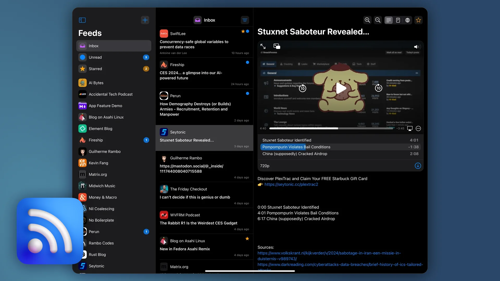
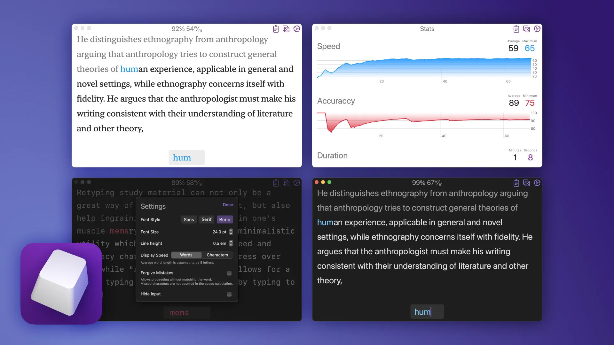

## Hi! 👋

> I'm **Arturs** an iOS engineer with interest in hardware hacking and decentralised communication.\
> Here you can find project overviews, tutorials and anything else worth sharing.

### Feed Radar

Feed Radar is an open source [MIT](https://choosealicense.com/licenses/mit/) licensed reader with a built in article extraction and emphasis on good media support. (podcast chapters, offline playback, quicklook, picture-in-picture, etc...)

- [**Github Repository**](https://github.com/levitatingpineapple/feed-radar)
- [**Join Public Beta!**](https://testflight.apple.com/join/kRcbarg4)

### Type to Learn

Type to Learn is a minimalistic macOS utility for touch typing practice that allows users to choose a text source. Retype the text to train muscle memory. Words per minute and accuracy metrics help with tracking progress over time.

- [**Available on the App Store!**](https://apps.apple.com/us/app/type-to-learn/id1401007562)
- [**Legacy Version**](type.zip) *macOS Sierra or later*.

### Polygonome

<video autoplay muted playsinline loop>
<source src="polygonome.mp4" type="video/mp4">
</video>

This metronome utilizes polygons to visually represent polyrhythms in an easily understandable manner. Automatic per-beat subdivision calculations make it simple to learn complex patterns, such as 7/4/3 or 9/5/4. Simply drag or tap on polygons to activate them, and press play! It is a valuable tool for individuals studying Carnatic Music.\

- [**Available on the App Store!**](https://apps.apple.com/us/app/polygonome/id1316236759)

## Contact

| Services                     |                                                                |
| ---------------------------- | -------------------------------------------------------------- |
| SimpleX Chat                 | [contact](https://simplex.chat/contact#/?v=2-6&smp=smp%3A%2F%2FZKe4uxF4Z_aLJJOEsC-Y6hSkXgQS5-oc442JQGkyP8M%3D%40smp17.simplex.im%2FryUM9QCNMDSldaKEYwHepjrEnrrkvI2Y%23%2F%3Fv%3D1-3%26dh%3DMCowBQYDK2VuAyEAVuXjuT7SqSd1L_g2svZ7chAWmvis5804CiDF8IueUUg%253D%26srv%3Dogtwfxyi3h2h5weftjjpjmxclhb5ugufa5rcyrmg7j4xlch7qsr5nuqd.onion)               |
| GitHub                       | [/levitatingpineapple](https://github.com/levitatingpineapple) |
| Email                        | arturs аt thіѕ dоmаіn                                          |
| GPG                          | [asc](gpg.txt), [gnu](gpg.gnu)                                 |
