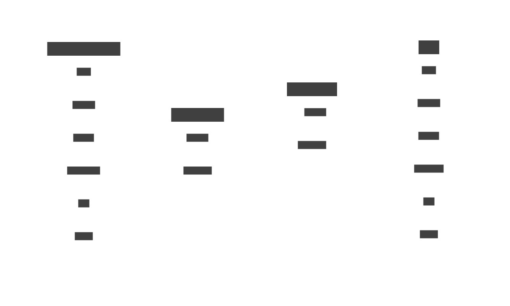

While theming might appear simple at first glance a fair bit of complexity can appear once full context is taken into account. Some common challenges include, but are not limited to:

- Theme's target changing over time i.e. handling deprecation
- Inability to assume theme authors having full context of the software
- Accessibility requirements like [contrast](https://www.w3.org/TR/WCAG21/#dfn-contrast-ratio) or color blindness

As the project grows in scale (and age) I've seen theming going through often predictable stages with **Stage 0** being copy-pasting `#HEX` codes from the design into the codebase.

## Stage One

Referencing by **WHAT** color is used

A common practice to ensure consistency is limiting colors to a finite set called **palette**.
The palette colors often come with a *marketing name* like [Pantone's](https://margaret2.github.io/pantone-colors) **Seashell Pink** or **Ruby Wine**.
While these names do a great job at conveying the artisanal color picking and evoke abstract associations, they often fall short at being used as references for few reasons:

- Having reference that leaks information about the color itself restricts what it can reasonably point to
- Its easy to *"theme yourself into a corner"* where you will end up doing a lot of `find & replace`
- These names carry **no information about how they are used** in the project making it trivial to use them in an inconsistent way

Great example of direct palette usage is present in terminal emulators, which allow *theming* the first [16 ANSI Colors](https://en.wikipedia.org/wiki/ANSI_escape_code#Colors). Some fascinating historical accounts can be found on [xterm's FAQ](https://invisible-island.net/xterm/xterm.faq.html) where the maintainers answer questions such as: [I don't like that shade of blue](https://invisible-island.net/xterm/xterm.faq.html#dont_like_blue) with "Nobody Does..." 😀.\
Additionally, if we look at the wide variety of interpretations of color *Yellow* over the years, 

## Stage Two

*Referencing by **WHERE** a color is used*

The next logical step to solve Stage 1 issues is to name colors by where they are used instead. Think of references like `scrollbar`, `modalPopoverBackground`, `loginBorder` etc. For smaller projects and/or projects that don't change too much this approach actually works quite well. For large or dynamic projects I have experienced of two main issues:

**1. Maintainability**
 
- Size of the theme grows **linearly** with the project which might still be manageable.
- The time it takes to create a new theme can see a **quadratic increase** though, since for every color themes author has to find, where it's used.
- When adding new features to the software there are now `n!` 🙀 possible color transitions. This makes it almost impossible not to break existing themes without increasing reference count even further.

**2. Barrier of Entry**

This tight coupling also means that the theme authors are required to have **full** understanding of the software.
Let's look at [Ableton LIVE](https://www.ableton.com/en/live/what-is-live/) - a fairly complex audio workstation, which has a thriving theming community. Creating themes for it is not trivial. Good luck finding where colors like `ViewCheckControlDisabledOff` is used in the software within 160 other references. To mitigate the issue people have been creating tools like [livethemes](https://www.livethemes.co) with an online GUI theme editor, but that is not ideal either as the tool has to be constantly maintained. Looking at their [FAQ](https://www.livethemes.co/faq) the issues become more apparent:

>**Will these themes work in Ableton 11?**\
>Early tests show are they do work in Ableton 11 but are not fully optimized for it. As soon as the final version of Ableton 11 gets released we'll get working on a 'Download for Ableton 11' option.\

>**I can't find {insert element here} to customize.**\
>There are lots of elements you can customize within a theme, and unfortunately we haven't been able to map all of them to the preview yet...

As we can see, this approach starts to fall apart when number of colors approach triple digits due to the non-linear nature of growth in complexity. The tricky part is that the issues only reveal themselves after the project is already large and refactoring has become a significant effort.

## Stage Three

*Referencing by **HOW** a color relates to other colors*

This approach introduces an abstraction layer between the software and palette. The colors are named by how they are used **in relation to other colors**. Like `foreground` being used to draw text on `background` or `accent` being used sparingly to guide user's attention. The color names ideally do not leak any implementation details from the software itself or exact colors used. The format of the theme only defines a set of requirements like minimum contrast or matching perceived luminance. This approach also makes themes portable and enables them to be used across various applications, which is why this approach is often used UI Frameworks and operating systems.

### Example

As an example let's imagine that we are building a CLI application and that we would like to use the existing 16 ANSI colors for compatibility. While we can't anticipate every color palette it would be very helpful to precisely define what our expectations are using a graph. This can be done in few steps:

1. Rename the main colors to reflect their usage like 
	- `bright-black` → `primaryBackground` 
	- `normal-red` → `error`
	- etc...
2. Create an undirected graph that describes the contrast requirements
	- I've grouped the colors to reduce the number of connections required
	- The connections describe minimum perceived contrast requirement for drawing text

With this abstraction in place:

- Graph can now serve as an interface between creators of the theme and software authors.
- It enables colors to be applied consistently when adding new features.
- Themes can now also be validated without explicit knowledge of current as well as future software implementations.

# Conclusion

In this article I outlined three ways of referencing colors:

| Approach                     | Description                        | Example                    |
| ---------------------------- | ---------------------------------- | -------------------------- |
| By **WHAT** color is used    | naive approach                     | `burgundyRed`, `paleBlue`  |
| By **WHERE** a color is used | works, but has scalability issues  | `buttonTitle`, `scrollbar` |
| By **HOW** a colors relate   | recommended                        | `background`, `accent`     |

I discussed how theming progresses from basic copy-pasting to more sophisticated approaches with each stage addressing specific challenges, with the ultimate goal of simplifying theme management and ensuring consistency and scalability across projects.
