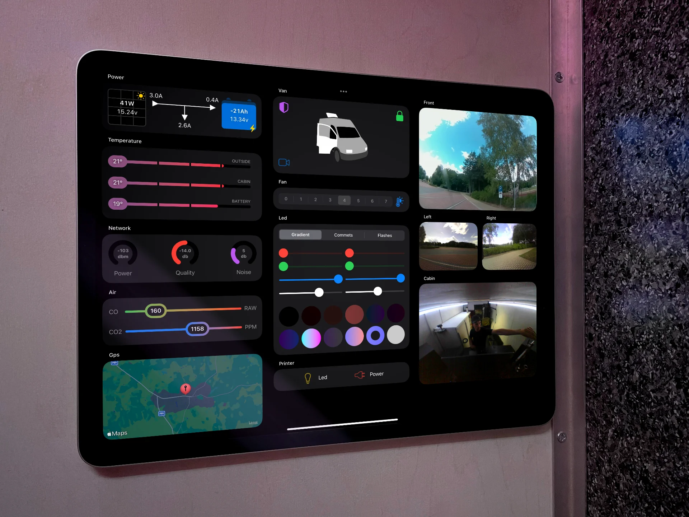
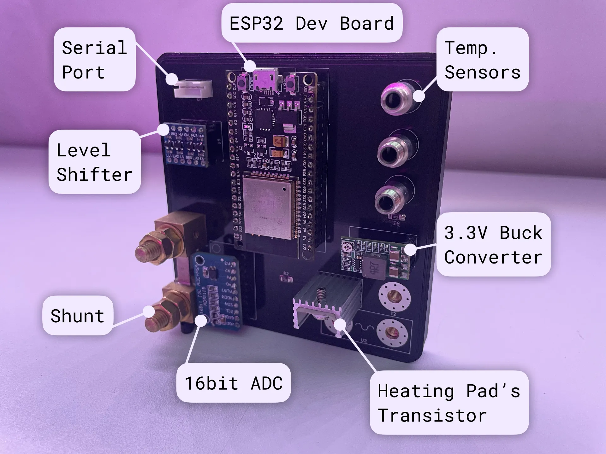

So I made an app for a camper-van... It has seen daily use for close to a year and honestly I'm quite impressed. It's based on [MQTT](http://docs.oasis-open.org/mqtt/mqtt/v3.1.1/os/mqtt-v3.1.1-os.html) protocol, which provides good ability to handle power and network outages and includes state persistence and restoration. The stack is quite lean for the amount of features and has been able to grow well while maintaining reasonable complexity.\
After some experimentation with existing solutions like [OpenHAB](https://www.openhab.org), [Home Assistant](https://www.home-assistant.io), [ESPHome](https://esphome.io) and even Apple Home via [Homebridge](https://homebridge.io) 
I came to the irresponsible decision to try and do it myself. 
While these open source projects are undeniably easier to get started with, I was finding that the added layer of abstraction and use of [DSL](https://en.wikipedia.org/wiki/Domain-specific_language)s made debugging rather tricky, beyond certain scale.

## Requirements

Features:

- **Monitoring** - being able to inspect state of the onboard systems, such as solar, temperature, air quality, internet connectivity as well as location and camera feeds.
- **Control** - ventilation, lights, car alarm with the ability to remotely disable the vehicle.
- **Automation** - ability to easily add and tweak automations. 

Technical:

- Reasonably scalable
- Stable and robust against power or network outages
- Low power/compute requirements (Solar powered)
- Runs locally with remote access trough VPN
- Uses common, easy to access components in case of hardware failure

## Architecture

The core of the system is a [single board computer](https://www.raspberrypi.com/products/raspberry-pi-3-model-b-plus/) running an open source broker [Mosquitto](https://mosquitto.org). The SBC provides a dedicated WiFi access point with static IP allocation, to allow [over the air](https://docs.espressif.com/projects/esp-idf/en/latest/esp32/api-reference/system/ota.html) updates. To provide some separation of concerns, the main functions are split between few dedicated clients.
The Internet connectivity if enabled by Mikrotik's [LtAP mini](https://mikrotik.com/product/ltap_mini). With the recent addition of [MQTT support](https://help.mikrotik.com/docs/display/ROS/MQTT) in RouterOS, I was also able to integrate GPS, and LTE by writing few simple [scripts](https://wiki.mikrotik.com/wiki/Manual:Scripting)

- **iOS App** - The only frontend. Some functionality exposed to Siri Shortcuts.
- **ESP32 Clients** - Controls and provides readings from external devices using plethora of available interfaces: UART, I2C, SPI, PWM.
- **Mosquitto Broker** - Source of truth for the system. Retains received state, and persists it on disk. It also periodically pings connected clients to verify connection integrity.
- **Database Client**
	- Logs sensor readings into a database, to provide ability to view history
	- Provides chart data for graphing a time range. 
	- The data points get down sampled and averaged to keep the UI responsive.
	- Cleans up old data
- **SQLite** - After comparing the performance of some dedicated time series databases like [InfluxDB](https://www.influxdata.com), I was pleasantly surprised by how much this self-contained engine can handle!
- **Automations Client** - Provides cross-client automations, or automations that require external information such as changing fan speed, depending on temperature or dimming lights after sunset.
- **Notifications Client** - One of iOS limitations is inability to reliably run any kind of background processes. This means having to rely on Apple's [push notification service](https://developer.apple.com/documentation/usernotifications/setting_up_a_remote_notification_server). While setting one up just for this seems like an overkill, luckily there are services [Pushover](https://pushover.net) that provide notifications as a service with a simple API. Not elegant, but it works! The notifications client listens to the broker's error topic where clients can report implausible sensor readings, connection status using [will topic](http://docs.oasis-open.org/mqtt/mqtt/v3.1.1/os/mqtt-v3.1.1-os.html#_Toc398718031) and other errors.

### Source of Truth

Since a lot is happening asynchronously, it's important to have a **single source of truth**. What it means in practice is that clients stateless, and does not retain readings for later publishing. They simply receive commands, update external devices, and report the state to the broker.
Clients also fetch the last retained state from broker on startup.\
This, combined with last will feature ensures that broker has up-to-date view of the system.

### Data Flow

Here's a simple toy example to illustrate data flow.\
Rounded boxes represent clients while squared ones contain topics:

❌ **Naive Approach** - Here the dimmer has two-way binding to the `room/light` topic and the Light client is simply consuming this state. While this setup mostly works, there are many cases where the state of the light could get out of sync. It could be dropped message or multiple instances of dimmer controlling the same light.

✅ **Unidirectional Data Flow** - MQTT Topics work on **publish/subscribe** principle and this makes them a *two way street*. To achieve unidirectional data flow my approach was separating the command topics (not retained) from those containing state (retained). Any client might only read or write to a certain topic. Now the state of the light originates at it's physical location - the light client. This also prevents potential feedback loops.

## Clients

Most clients were implemented using ESP development boards. The one above is responsible for managing the battery. It's built on a standard 100x100mm prototype PCB using common brake-out boards. The client has a serial connection to the solar charge controller using Victron's [VE.Direct](https://www.victronenergy.com/upload/documents/VE.Direct-Protocol-3.33.pdf) for reporting solar readings. It also measures battery current using a shunt. The state of charge is retained in the broker, for preservation between reboots.\
Since I'm using LiFePO4 batteries that would get damaged, if charged below freezing - the client also operates a heating pad using PWM based on temperature readings.

## Conclusion

While I could go into way more detail, hopefully this article provides a decent high level overview of one of many ways to approach building a system like this.
Overall the process has been a remarkable learning experience and my go-to justification for trying new things. This project involved broad range or technologies and tools such as 3d printing, PBC design/assembly, Rust, C++, Time Series Databases, SwiftUI, etc.\
While it certainly has been a significant time investment, if feel that system like this is generic enough with sufficiently wide range of applications to justify time spent. (Or at least that's what I tell myself)

[XKCD Comic](https://imgs.xkcd.com/comics/the_general_problem.png)
