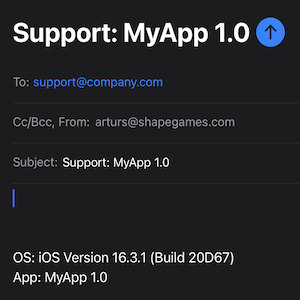

While including a flow for contacting support often comes as a last minute after-thought,\
having a great *complaining experience* can be instrumental in further improving the app.\
This is by no means a complex task, though there are a few gotchas along the way.

## Gathering Context

Feedback is often caused by a regression, which has been introduced in a certain release version, or only occurs in a specific environment.\
Therefore, it's useful to include this sort of data in the initial support request.
This avoids unnecessary back and forth.
Here's an example of gathering some commonly required context.

```swift
var app: String {
	Bundle.main.info("CFBundleDisplayName") + " " +
	Bundle.main.info("CFBundleShortVersionString")
}

var os: String {
#if os(iOS)
	let platform = "iOS "
#elseif os(macOS)
	let platform = "MacOS "
#endif
	return platform + ProcessInfo.processInfo.operatingSystemVersionString
}
```

*I'm using following extension to make fetching data from the app's bundle more convenient.*

```swift
extension Bundle {
	func info(_ key: String) -> String {
		infoDictionary.flatMap { $0[key] as? String }
		?? "Missing " + key
	}
}
```

## Constructing Link

The [mailto:](https://www.ietf.org/rfc/rfc2368.txt) URI scheme supports specifying **subject** and **body** using query parameters,\
which are then parsed by the user's default mail client.

```swift
var mailTo: URL {
	URL(string: "mailto:\(supportEmail)")!
		.appending(
			queryItems: [
				URLQueryItem(name: "subject", value: "Support: \(app)"),
				URLQueryItem(name: "body", value: "\n\n\nOS: \(os)\nApp: \(app)"),
			]
		)
}
```

## User Interface

When all is done, SwiftUI offers various ways of opening the constructed link:
- **Button** - using [openURL](https://developer.apple.com/documentation/swiftui/environmentvalues/openurl) environment variable

```swift
struct ContactSupportView: View {
	@Environment(\.openURL) private var openURL

	var body: some View {
		Button("Contact Support") { openURL(mailTo) }
	}
}
```

- **Inline** - Since iOS 15 SwiftUI supports limited markdown rendering. With one caveat that is.\
If we want to use anything else than simple string literals (like interpolation),\
[LocalizedStringKey(stringLiteral:)](https://developer.apple.com/documentation/swiftui/localizedstringkey/init(stringliteral:))
initialiser has to be used explicitly.

```swift
Text(
	LocalizedStringKey(
		stringLiteral: "Contact us [\(supportEmail)](\(mailTo))!"
	)
)
```

- Link - The simplest option!

```swift
Link("Contact Support", destination: mailTo)
```

## Result

Now users can create a simple mail template with a single tap!
As a bonus, consistent titles allow for some automation when handling support. This is especially true in cases where multiple apps are served fom a single support mail address.


