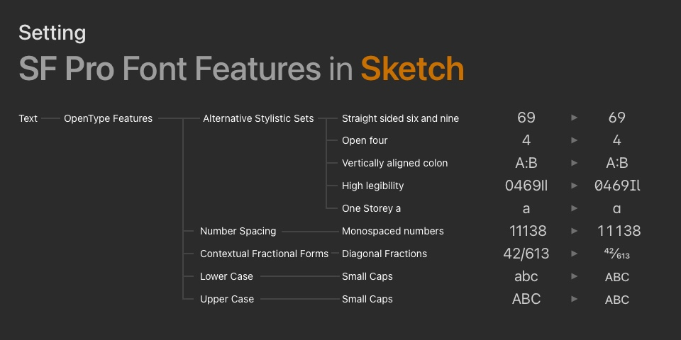

- This article is mostly based on [Introducing the New System Fonts](https://developer.apple.com/videos/play/wwdc2015/804/) WWDC session from 2015.
- If you'd like to add this to your project as a `UIFont` extension check out this [gist](https://gist.github.com/levitatingpineapple/396d1524954153aea928bf59e0502744).

It's been few years already since Apple ditched Helvetica in favor of their proprietary SanFrancisco font. While SFPro font family comes with plethora of features to satisfy even obscure typographic needs, actually finding and using these features can require parsing trough lengthy documentation.

## Feature Keys

Font features in [AAT](https://developer.apple.com/fonts/TrueType-Reference-Manual/RM06/Chap6AATIntro.html) (Apple  Advanced Typography) are enabled using a pair of keys. `type` for selecting a some feature and `selector` for enabling it. A non-exhaustive list of these features can be found in the [Font Feature Registry](https://developer.apple.com/fonts/TrueType-Reference-Manual/RM09/AppendixF.html)

To make working with keys a bit simpler we can create a small abstraction. `Feature` struct will let us name the key pairs as static variables and enjoy autocomplete.

```swift
struct Feature: Hashable {
	private let type: Int
	private let selector: Int
	var setting: [UIFontDescriptor.FeatureKey : Int] { 
		[.featureIdentifier: type, .typeIdentifier: selector]
	}
}
```

> ⚠️ The naming above is intentional.\
> The `.featureIdentifier` is set with `.k(...)Type` keys\
>  while `.typeIdentifier` uses `.k(...)Selector`.

The list of possible features is pretty long and some of them can only be used exclusively.
Here are most of the features, presented in the [WWDC session](https://developer.apple.com/videos/play/wwdc2015/804/). As you can see the keys can get pretty verbose.

```swift
static let straightSixAndNine = 
	Feature(type: kStylisticAlternativesType, selector: kStylisticAltOneOnSelector)
static let openFour = 
	Feature(type: kStylisticAlternativesType, selector: kStylisticAltTwoOnSelector)
static let alignedColon = 
	Feature(type: kStylisticAlternativesType, selector: kStylisticAltThreeOnSelector)
static let highLegibility = 
	Feature(type: kStylisticAlternativesType, selector: kStylisticAltSixOnSelector)
static let oneStoreyA = 
	Feature(type: kStylisticAlternativesType, selector: kStylisticAltSixOnSelector)
static let monospacedNumbers = 
	Feature(type: kNumberSpacingType, selector: kMonospacedNumbersSelector)
static let diagonalFractions = 
	Feature(type: kFractionsType, selector: kDiagonalFractionsSelector)
static let loverCaseSmallCaps = 
	Feature(type: kLowerCaseType, selector: kLowerCaseSmallCapsSelector)
static let upperCaseSmallCaps = 
	Feature(type: kUpperCaseType, selector: kUpperCaseSmallCapsSelector)
```

## Caching

When required frequently enough, constructing fonts with typographic features can be considered an expensive operation. Therefore, we can introduce a simple caching mechanism using a dictionary. This dictionary is keyed by a hash-able struct, which represents the required function parameters.

```swift
private static var cache = [Key: UIFont]()
private struct Key: Hashable {
	let size: CGFloat
	let weight: Weight
	let features: [Feature]
	let italic: Bool
}
```

## Usage

With setup work out of the way, the font can now be constructed! 
- First we create a `Key` from the function parameters and return a cached font, if one exists. 
- Then a `FontDescriptor` is constructed as a base
- After that a font is composed by adding attributes and symbolic traits.
- Finally, the font is stored in the cache and returned.

```swift
static func systemFont(
	ofSize size: CGFloat,
	weight: Weight = .regular,
	features: [Feature] = [],
	italic: Bool = false
) -> UIFont {
	let key = Key(size: size, weight: weight, features: features, italic: italic)
	if let font = cache[key] { return font }
	let descriptor = UIFont.systemFont(ofSize: size, weight: weight).fontDescriptor
	let font = UIFont(
		descriptor: descriptor
			.addingAttributes([.featureSettings: features.map { $0.setting }])
			.withSymbolicTraits(descriptor
				.symbolicTraits
				.union(italic ? .traitExpanded : .init(rawValue: 0))
			) ?? descriptor,
		size: size
	)
	cache[key] = font
	return font
}
```

## For Designers

- **Figma** has supported open type features since 2019.\
More information available in the [Ode to OpenType](https://www.figma.com/blog/opentype-font-features/) article.
- If the design is done using **Sketch** OpenType features are available from the menu bar: `Text/OpenTypeFeatures/...`.


